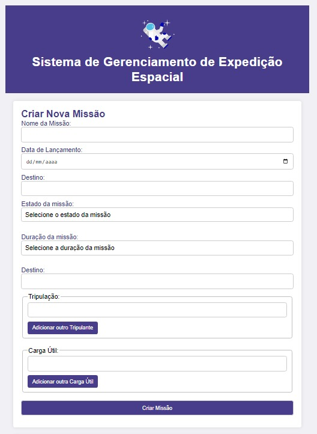

# Sistema de Gerenciamento de Expedição Espacial

Este projeto é um simulador de expedição espacial, desenvolvido como parte da disciplina de Desenvolvimento Rápido de Aplicações em Python (RAD) do curso de Ciência da Computação. O sistema permite gerenciar missões espaciais, integrando um frontend para interação do usuário e um backend em Python para o processamento e armazenamento dos dados.

## Contexto Acadêmico

*   **Curso:** Ciência da Computação
*   **Disciplina:** Desenvolvimento Rápido de Aplicações em Python (RAD)
*   **Projeto:** Sistema de Gerenciamento de Expedição Espacial (Extensão)
*   **Discentes**: Isaias Santos, Singrid Maria, Jardel Guimarães, Yuri Silva
*   **Universidade:** Estácio de Sá - Polo Parangaba
*   **Professora:** Cynthia Moreira

## Arquitetura do Sistema

O projeto adota uma arquitetura cliente-servidor tradicional, separando claramente as responsabilidades de interface do usuário e lógica de negócios.

### Frontend
A interface do usuário foi desenvolvida para ser leve e acessível diretamente pelo navegador.
*   **Tecnologias Utilizadas:** HTML, CSS e JavaScript.
*   **Responsabilidade:** Fornecer uma interface intuitiva para que os usuários possam simular o gerenciamento das expedições e visualizar o status das missões.

### Backend
O núcleo do sistema foi construído em Python, focando na criação de uma API eficiente para gerenciar os dados da simulação.
*   **Tecnologias Utilizadas:** Python (Flask).
*   **Banco de Dados:** SQLite.
*   **Responsabilidade:** Fornecer uma API RESTful para processar as requisições do frontend, validar as regras de negócio e persistir as informações das missões.

## Para Desenvolvedores

Se você deseja explorar ou contribuir com o código, consulte a documentação técnica específica para cada módulo:

*   [Documentação Técnica do Backend](./expedicao-espacial-back/README.md)

## Como Executar

(Adicione aqui as instruções gerais para rodar o projeto, como `npm install`, `python app.py`, etc., caso aplicável).
